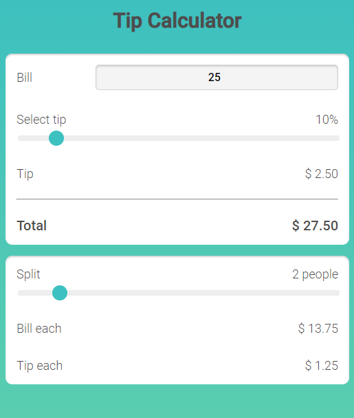

# Tip Calculator

A tip calculator that considers the cost of the service, number of people, and chosen tip percentage to calculate the tip per person, as well as the total cost per person.

    

## Live Demo

- [Live Demo in Netlify](https://tip-calc-demo.netlify.app/)

## Built With

- HTML
- CSS
- JavaScript

## Author

**Ricardo Reiter**

- GitHub: [@ricareiter](https://github.com/ricareiter)
- Linkedin [Ricardo Reiter](https://www.linkedin.com/in/ricardoreiter/)

## 🤝 Contributing

Contributions, issues, and feature requests are welcome!

Feel free to check the [issues page](https://github.com/ricareiter/tip-calculator/issues).

## Show your support

Give a ⭐️ if you like this project!

## 📝 License

This project is [MIT](./LICENSE) licensed.
